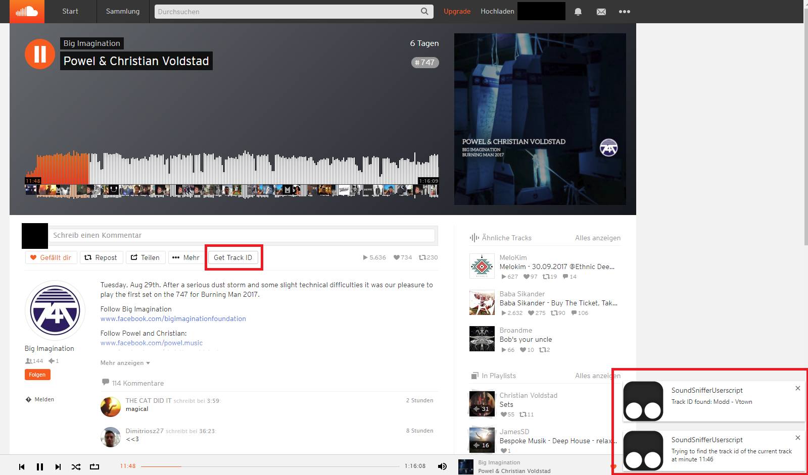

# SoundSnifferUserscript

Find the id of the track you are listening to on Souncloud. Just press the button.

Uses Christoph Portmann's soundsniffer service (https://github.com/chrisport/SoundcloudToTrackID, http://soundsniffer.chrisport.ch/)

*Tested with Tampermonkey on Google Chrome*
